---?image=assets/img/pencils.jpg
@title[Code Presenting Templates]

## @color[black](Code Presenting<br>Slide Templates)

@fa[arrow-down text-black]

@snap[south docslink span-50]
[The Template Docs](https://gitpitch.com/docs/the-template)
@snapend


+++
#### Svg Test




+++
### Another Svg Test
[]


+++?color=cpp
@title[Fenced Code Block]

```cpp
// Update our delta time for physics simulation.
DeltaTime = ClientData->UpdateTimeStampAndDeltaTime(DeltaTime, *CharacterOwner, *this);

// Get a SavedMove object to store the movement in.
FSavedMovePtr NewMovePtr = ClientData->CreateSavedMove();
NewMove->SetMoveFor(CharacterOwner, DeltaTime, NewAcceleration, *ClientData);
PerformMovement(NewMove->DeltaTime);
NewMove->PostUpdate(CharacterOwner, FSavedMove_Character::PostUpdate_Record);

CallServerMove(NewMove, OldMove.Get());
```

@[1,2](Get DeltaTime)
@[4-8](Prepare SavedMove and Perform Move)
@[10-10](Call ServerMove)

@snap[north-east template-note text-gray]
ReplicateMoveToServer
@snapend


+++?gist=onetapbeyond/494e0fecaf0d6a2aa2acadfb8eb9d6e8&lang=scala&color=black
@title[GitHub GIST]

@[1-6](You can even present code found within any GitHub GIST.)
@[41-53](GIST source code is beautifully rendered on any slide.)
@[57-62](Code-presenting works seamlessly both online and offline.)

@snap[north-east template-note text-white]
Code presenting GitHub GIST template.
@snapend


+++?color=#36454F
@title[Fenced Text Block]

```text
.
├── PITCHME.md
├── PITCHME.yaml
└── template
    ├── css
    │   └── PITCHME.css
    ├── img
    │   ├── batman.png
    │   ├── dataflow.png
    │   ├── developer.jpg
    │   └── ....
    └── md
        ├── about/PITCHME.md
        ├── announcement/PITCHME.md
        ├── code-presenting/PITCHME.md
        ├── header-footer/PITCHME.md
        ├── image/PITCHME.md
        ├── list-content/PITCHME.md
        ├── quotation/PITCHME.md
        ├── sidebar/PITCHME.md
        ├── sidebox/PITCHME.md
        ├── split-screen/PITCHME.md
        └── wrap-up/PITCHME.md
```

@[1-3, 6](Code presenting can also be used to step through any text-based content.)
@[4,5,7,12](Here for example we can navigate through the directory structure for this template.)
@[12-23](We can see that this template uses GitPitch's cool modular markdown support @fa[smile-o fa-spin])

@snap[north-east template-note text-white]
Code presenting fenced text block template.
@snapend
